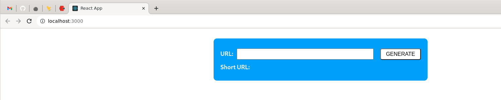

# URL Shortener Web
It's a Web application and is build on React v18.2.0.

## Prerequisites & Setup

### Prerequisites

1. NodeJs - Can be downloaded from the official [download page](https://nodejs.org/en/download)
2. The application it's depends on 'URL Shortener API'

### Config
The project have config file located in 'url-shortener-web/src/config.json'. The file contains some configs such as
```json
{
  "URL_SHORTENER_API_HOST": "http://localhost",
  "URL_SHORTENER_API_PORT": "8080"
}
```

### Setup

1. Open Linux terminal and navigate to your projects directory
```shell
cd /projects/
git clone https://github.com/seeff00/url-shortener.git
cd url-shortener/url-shortener-web

npm install
npm run build
npm start
```

## Usage
1. Now you can open your browser and navigate you to http://localhost:3000. 
You should see a web form as shown on image below



2. Enter some URL in the input field 'URL' and click on the button with text 'GENERATE'


Test URL: https://translate.google.bg/?hl=bg&sl=en&tl=bg&text=Hello%20world&op=translate

3. In 'Short URL' you will find your short URL. When you click on it
you will be redirected to a new tab loaded with your original URL.

